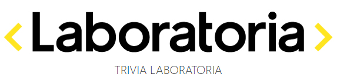
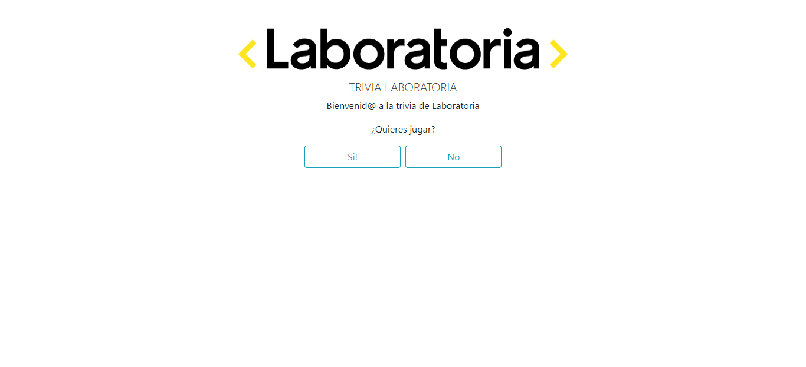
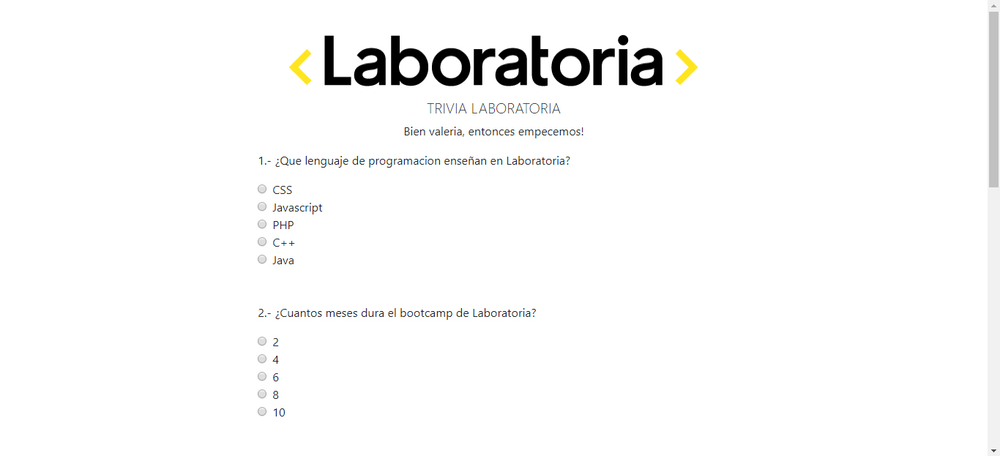
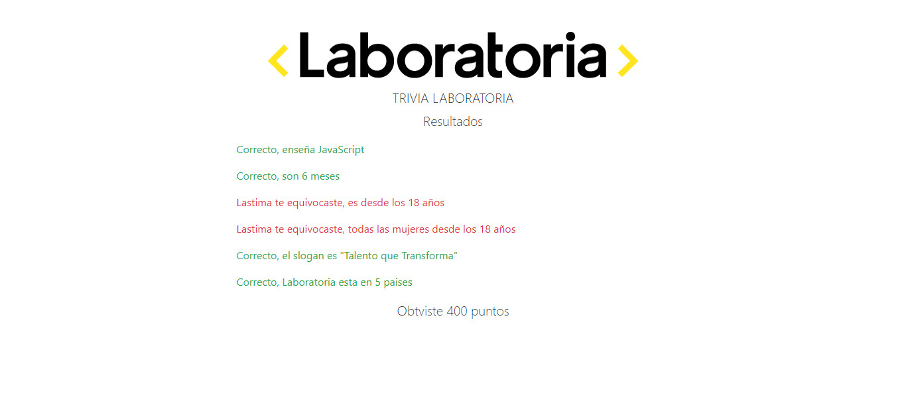

**"Trivia Laboratoria"** fue el primer proyecto realizado en laboratoria durante la semana de preadmisión y luego optimizada durante la primera semana de clases.

## Tecnología usada

* Html
* Css
* Javascript
* Bootstrap (versión mejorada)

## Vistas

## Enlace deploy

deploy versión mejorada

deploy version semana de preadmisión

